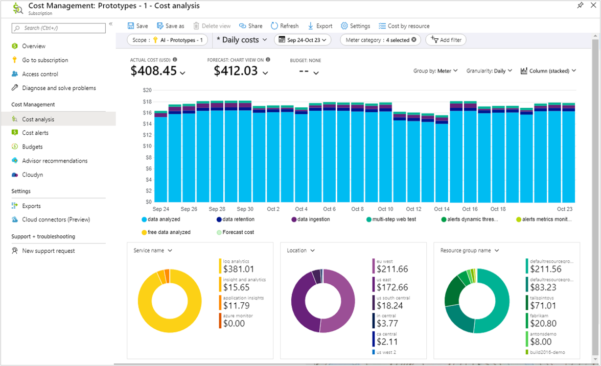

# Part 4: Consumption-Based Pricing Model

## Objectives:
* Describe the consumption-based model

-----

In a system, typical usage will fluctuate over time! Hence, you'll want to allocate as many resources to the system as necessary whilst only paying for the ones you consumed.

## Definition
> A consumption-based pricing model is one where you pay only for what resources you use.

---

## What is the consumption-based model?
This sort of model aligns with OpEx:
* You pay for the ongoing operational costs of running your system, and there are no wasted resources because you're only paying for what you're using.
* You avoid the upfront costs in CapEx of paying for your own hardware and software licenses, instead paying for Azure services on a monthly basis.
* Additionally, you're not responsible for your own infrastructure - you can focus on the core business.

## Example
Take a Virtual Machine as an example:
* Your price for using the VM is based on certain metrics
* These metrics will include:
  * **Compute power**: How much power is your VM using up?
  * **Networking**: What networking is the VM doing?
  * **Storage**: What is being stored?

Hence, a consumption-based pricing model is made up of different components for each service. You are charged granular costs for each different aspect:

As we can see - the charges are _granular_ - if you're only going to use a Virtual Machine for 20 seconds, you only pay for those 20 seconds.