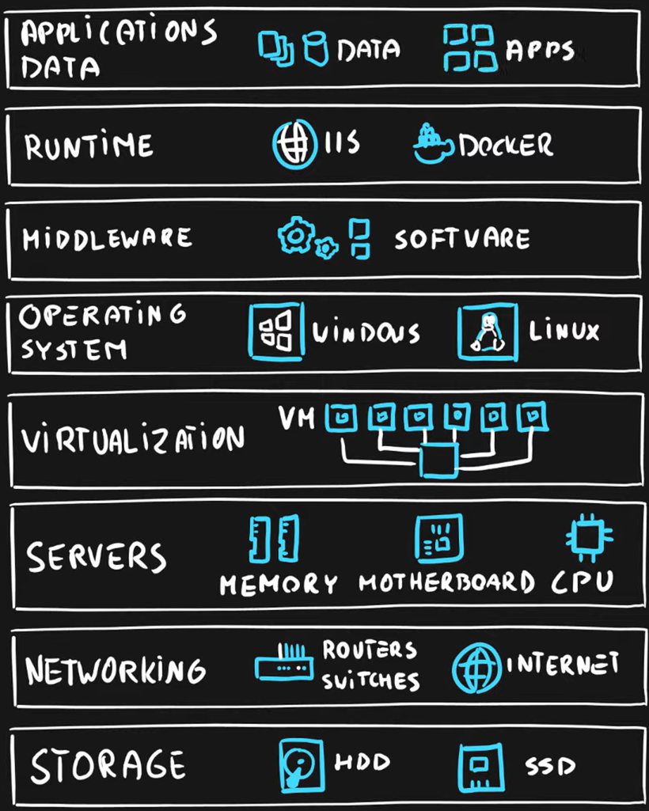

# Part 5: Cloud Service Models

## Objectives
* Describe Infrastructure as a Service
* Describe Platform as a Service
* Describe Software as a Service

---
## Layers of an Application
 
There are various layers to an application, including different levels of 'service' that can be provided by the cloud.

These layers include...

## Infrastructure
This layer directly relates to the **hardware** and **virtualization** that is required to run the platform. I.e:
* Servers
* Networking
* Storage
* Virtual Machines

## Platform
This layer consists of all the supporting software and Operating System(s) to host the application. This includes the middleware and anything needed for runtime (i.e. IIS, Docker)

## Software
This layer is essentially the applications and data being used! 

---

Service models ask one simple question:
> Who runs what?

## On-premise
If you are in charge of _everything_ for your system, then you have an on-premise application. This means:
* You aren't using any sort of cloud provider
* You are managing everything

## Infrastructure as a Service (IaaS)
However, you might want to - at the very least - outsource, or let Microsoft manage your infrastructure (your networking, hardware, virtualization) whilst you manage the platform and software. This is IaaS. There are various use cases for having the Cloud manage your infrastructure:
* Migration of workloads
* Testing and development
* Storage, Backups and Recovery

Naturally, with an IaaS solution, you have _lots of Virtual Machines_ involved!

## Platform as a Service (PaaS)
Going one level up..